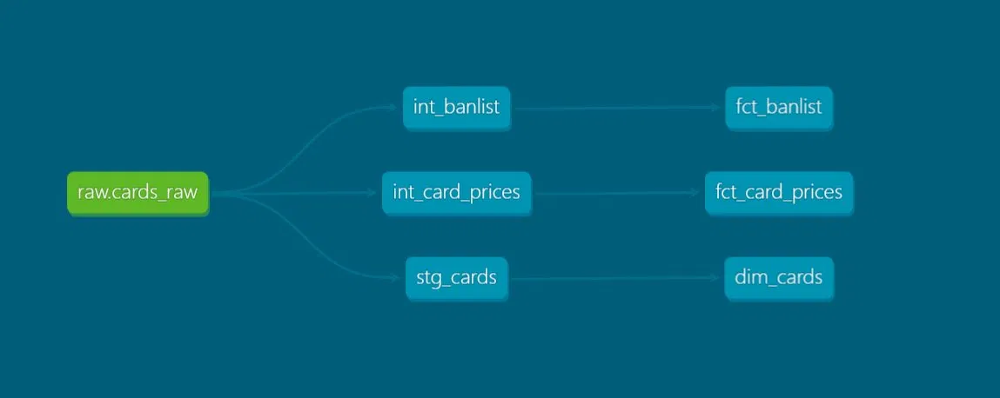

# Yugioh-meta-pipeline

An end-to-end ELT data pipeline that ingests the full Yu-Gi-Oh! card catalog from the YGOPRODeck API, models it into a dimensional star schema with dbt, orchestrates the workflow with Apache Airflow, and surfaces meta and market insights through a Power BI dashboard.


---

## Overview

This project demonstrates a complete, production-style data engineering workflow built around a domain I know well. It extracts ~14,000 cards from a public API, lands them raw in PostgreSQL, transforms them through layered dbt models into a tested star schema, and schedules the whole pipeline with Airflow — all containerized with Docker. The data model is designed to be **snapshot-aware**: dimensions reflect the current state while fact tables accumulate history over time.

---

## Architecture

```
YGOPRODeck API
      │
      ▼
   Python  ──────►  PostgreSQL (raw schema)
 (extract)              │
                        ▼
                      dbt  ──►  staging ──► intermediate ──► marts (star schema)
                        │
                        ▼
                     Airflow  (orchestrates: extract → dbt run → dbt test, daily)
                        │
                        ▼
                    Power BI  (Meta & Market dashboard)
```

The pipeline follows the **ELT** pattern: raw API responses are loaded untransformed (preserving the source), and all transformation logic lives in dbt. dbt models are organized in three layers:

- **staging** — flattens raw JSON into clean, typed columns (one model per source).
- **intermediate** — applies business logic: unnesting price arrays, resolving banlist status (absence of banlist data means a card is *Unlimited*).
- **marts** — the final star schema consumed by Power BI.

---

## Tech Stack

| Tool | Role |
|------|------|
| **Python** | API extraction and raw load |
| **PostgreSQL** | Data warehouse (raw + analytics schemas) |
| **dbt** | Layered SQL transformations, testing, documentation |
| **Apache Airflow** | Workflow orchestration and scheduling |
| **Docker** | Containerization of all services |
| **Power BI** | Visualization and dashboarding |

---

## Data Model

A star schema with one dimension and two historical fact tables:

- **`dim_cards`** — one row per card with descriptive attributes (name, type, attribute, archetype, ATK/DEF/level). Filtered to the most recent snapshot via a window function.
- **`fct_banlist`** — banlist status (Forbidden / Limited / Semi-Limited / Unlimited) per card per snapshot date.
- **`fct_card_prices`** — vendor prices (TCGplayer, Cardmarket, eBay, Amazon, Coolstuffinc) per card per snapshot date.

Facts join to the dimension on `card_id` in a one-to-many relationship. Data quality is enforced with dbt tests: `unique`, `not_null`, `relationships` (referential integrity), and `accepted_values`.


<!-- Replace docs/dbt-lineage.png with the dbt docs lineage graph -->

---

## Project Structure

```
yugioh-meta-pipeline/
├── docker-compose.yml              # Data PostgreSQL stack
├── extraction/
│   ├── extract.py                  # API extraction → raw load
│   └── requirements.txt
├── sql/
│   └── init/
│       └── 01_create_raw_schema.sql
├── dbt/
│   └── yugioh/
│       ├── dbt_project.yml
│       └── models/
│           ├── staging/
│           │   ├── sources.yml
│           │   └── stg_cards.sql
│           ├── intermediate/
│           │   ├── int_banlist.sql
│           │   └── int_card_prices.sql
│           └── marts/
│               ├── marts.yml
│               ├── dim_cards.sql
│               ├── fct_banlist.sql
│               └── fct_card_prices.sql
├── airflow/
│   ├── docker-compose.yaml         # Airflow stack
│   └── dags/
│       └── yugioh_pipeline.py      # extract → dbt run → dbt test
└── dashboard/
    └── yugioh-dashboard.pbix
```

---

## How to Run

### Prerequisites
- Docker Desktop (4 GB+ memory allocated)
- Python 3.11+ with a virtual environment
- Power BI Desktop (to open the dashboard)

### 1. Create the shared Docker network
```bash
docker network create yugioh_network
```

### 2. Start the data warehouse
```bash
docker compose up -d
```
This launches PostgreSQL on port `5433` and initializes the `raw` schema.

### 3. Run the extraction
```bash
cd extraction
pip install -r requirements.txt
python extract.py
```

### 4. Run the dbt transformations
```bash
cd dbt/yugioh
dbt run
dbt test
```

### 5. Start Airflow
```bash
cd airflow
docker compose up airflow-init   # first time only
docker compose up -d
```
Access the Airflow UI at `http://localhost:8080` (default credentials: `airflow` / `airflow`), then enable and trigger the `yugioh_pipeline` DAG.

### 6. Open the dashboard
Open `dashboard/yugioh-dashboard.pbix` in Power BI Desktop. It connects to PostgreSQL at `localhost:5433`.

> **Note:** A `profiles.yml` (dbt) and `.env` files hold local credentials and are excluded from version control. Configure them locally before running.

---

## Key Design Decisions

- **ELT over ETL** — raw JSON is preserved in PostgreSQL, allowing transformations to be re-run without re-hitting the API.
- **Snapshot-aware modeling** — each pipeline run is timestamped, so facts build historical trends while dimensions stay current.
- **Separate stacks on a shared network** — the data warehouse and Airflow run as independent Docker Compose stacks connected through an external network, mirroring real-world service separation.
- **Data quality at the source** — sentinel prices (e.g. `999.99` placeholders) are neutralized in dbt, so every downstream consumer receives clean data.

---

## Future Improvements

- Add a `dim_dates` dimension for richer time-series analysis as snapshots accumulate.
- Replace `_PIP_ADDITIONAL_REQUIREMENTS` with a custom Airflow image for faster, production-ready builds.
- Implement dbt snapshots for slowly changing dimensions.
- Add CI/CD to run `dbt test` automatically on pull requests.

---

## Author

**Vladimir** — [GitHub: VladimirGarcia17](https://github.com/VladimirGarcia17)